# 验证猜想：LeWM 世界模型的 latent drift 诊断（PushT）

> **本 MD = 诊断线**。问题：LeWM 这类 latent 世界模型在 ID/visual/geometry 下的 open-loop latent reasoning 到底有没有问题、是哪种问题。
> 解决方案线（离散承诺锚点 / TwoRoom / Exp2）见 [commitment_anchor_discrete.md](commitment_anchor_discrete.md)。
> 两个 MD 共享下面第 0 节的实验对象与定义。

这份 MD 是诊断侧的累积记录。后续诊断实验在本文按顺序新增 phase；最底部的"综合分析理解"始终替换为最新版本。每个 phase 内部小结保留。

已完成（诊断）：

- Phase 1: corrected behavior-level LGHL sweep。
- Phase 2: fixed-trajectory latent drift。
- Phase 3: same-state encoder, re-grounding, and geometry replay controls。
- Phase 4: contact/event, warm-start, and latent-to-action-quality controls。
- Phase 5: ID long-horizon planning diagnostics。
- Phase 6: latent drift error-vector structure diagnostics。
- Phase 7: manifold geometry, projection recovery, lag, and multi-seed error bars。

> Phase 8（solution-side commitment-anchor proposer）已迁到解决方案 MD。

## 0. 公共背景与定义

### 实验对象

模型：

- checkpoint: `quentinll/lewm-pusht`
- 模型类: `stable_worldmodel.wm.lewm.lewm.LeWM`
- checkpoint 缓存: `/root/.stable_worldmodel/checkpoints/models--quentinll--lewm-pusht/`
- checkpoint 文件: `config.json`, `weights.pt`
- backbone 日志: ViT-tiny, hidden size 192, 12 layers, 3 attention heads, image size 224, patch size 14
- 参数量检查: 18,034,478

数据：

- dataset: `quentinll/lewm-pusht`
- HDF5: `/root/.stable_worldmodel/datasets/pusht_expert_train.h5`
- 总行数: 2,336,736
- evaluation 合法起点数: 1,869,611

机器和环境：

- server: `fnii-vla2`
- server repo: `/code/wge/stable-worldmodel`
- Python: `/root/miniconda/envs/lerobot/bin/python`
- corrected Phase 1 使用当时空闲的 A100 `0,6`
- Phase 2/3/4 latent drift/control 使用 GPU 6
- 最初 GPU 利用率低不是 CUDA/JAX 没识别 GPU，而是 CPU oversubscription；后续用 `SWM_TORCH_THREADS=2` 和 `--threads-per-run 2` 控制每个 eval 的 CPU 线程数

### H、R、Verify-gap

PushT 默认 LeWM planning 配置来自 `scripts/plan/config/pusht.yaml`：

```text
horizon = 5
receding_horizon = 5
action_block = 5
warm_start = true
```

定义：

- `H = horizon`: CEM planner 每次让 world model 在 latent 里 rollout 多长。
- `R = receding_horizon`: 计划执行多少个 model step 后重新看真实 observation 并重新规划。
- `action_block = 5`: 每个 planned action 在真实环境里重复执行 5 个 env steps。
- `verify_gap_env_steps = R * action_block`: 两次真实 observation grounding 中间隔了多少 env steps。

默认 LeWM eval 对应：

```text
H = 5
R = 5
action_block = 5
verify_gap_env_steps = 25
```

这里要特别区分：`H=5` 不是 checkpoint 内部固定死的模型结构参数，而是 test-time MPC/CEM planner 的 planning horizon。`config.json` 里的 predictor `num_frames=3` 表示模型看多少帧 history，不是 planner 的 `H`。

因此我们没有把“训练成 H=5 的模型内部改成 H=10”。我们做的是：用同一个 checkpoint，在测试时改变 planner 每次搜索多长、执行多长，然后观察 behavior 和 latent drift 怎么变化。

两个例子：

```text
H=3, R=1
```

LeWM 每次想象未来 3 个 model step，也就是 15 个 env steps；但 planner 只执行第 1 个 model step 对应的 5 个 env steps，然后立刻重新看真实 observation 并重新规划。

```text
H=5, R=5
```

LeWM 每次想象未来 5 个 model step，也就是 25 个 env steps；planner 把整段计划执行完后才重新规划。这就是默认 LeWM PushT eval。

### Shift 定义

三组环境条件不是三种指标，而是三种 evaluation condition。每组都用同一个 checkpoint 和同一个 metric。

| shift | reset options | 含义 |
| --- | --- | --- |
| `id` | none | PushT 默认 variation: 采样 agent/block 初始位置和 block angle，颜色、形状、尺度保持默认 |
| `visual` | `background.color,agent.color,block.color,goal.color` | 改外观，不刻意改任务几何和接触关系 |
| `geometry` | `block.scale,agent.scale,block.shape,goal.scale` | 改尺度、形状、goal 大小和接触几何 |

## Phase 1: Corrected Behavior-Level LGHL

### 目的

Phase 1 不直接看模型内部 latent，只看控制层面是否成功。核心问题是：

```text
在同一个 LeWM checkpoint 下，改变 H/R 和 FoV shift 后，PushT success_rate 怎么变？
```

### 修正点

Phase 2 过程中发现 `pusht_expert_train.h5` 里有 `pixels` 列。旧版 dataset-driven eval 会从 dataset 里抽 init/goal，并把 dataset 中已有的 `pixels/goal` 写回 `world.infos`。这会部分覆盖 `reset_options` 后环境重新 render 出来的 shifted observation。

这就是旧 Phase 1 visual 结果过于乐观的原因。当前 Phase 1 已经修正并重跑：

- 起点和 goal state 仍来自 dataset。
- 不再用 HDF5 的 `pixels/goal` 覆盖当前 observation。
- 应用 `id/visual/geometry` reset options 后，当前 `pixels` 由 shifted env 重新 render。
- goal image 也会临时设到 goal state 后重新 render，再恢复 init state。
- 全量 63/63 个 cell 已重跑，全部 `returncode=0`。

### 设置

```text
script = scripts/plan/lghl_sweep.py
eval = scripts/plan/eval_wm.py
policy = quentinll/lewm-pusht
num_eval = 50
seed = 42
goal_offset_steps = 25
eval_budget = 50
action_block = 5
H in {1,2,3,5,8,10}
R in {1,2,3,5,8,10}, with R <= H
shift in {id, visual, geometry}
eval.video = false
```

每个 episode：

1. 从 expert dataset 采样一个合法起点。
2. 用同一条 expert trajectory 中未来 `goal_offset_steps=25` 的 state 作为 goal。
3. 将当前 observation 和 goal image 输入 LeWM + CEM planner。
4. planner 按 `H` 和 `R` 做 MPC rollout。
5. 环境最多执行 `eval_budget=50` 步。
6. PushT 环境在预算内给出成功终止信号，则记为 success。

指标：

```text
success_rate = 100 * (# successful episodes / num_eval)
S(H, R, shift) = success_rate
verify_gap_env_steps = R * 5
```

原始 behavior-level half-life 想定义为：

```text
tau_0.5(H, shift) = min R such that S(H, R, shift) <= 0.5 * S(H, R_min, shift)
```

但本轮曲线经常不是单调下降，所以这个 tau 不能作为单一 headline。更可靠的是看完整曲线、`R=H` 对角线、shift-vs-ID delta/ratio。

### 输出

服务器：

```text
/code/wge/stable-worldmodel/outputs/lghl_phase1_corrected_results.csv
/code/wge/stable-worldmodel/outputs/lghl_phase1_corrected_analysis/
```

本地：

- [Combined results](lghl_figures/lghl_combined_results.csv)
- [Combined summary](lghl_figures/lghl_combined_summary.csv)
- [Shift vs ID](lghl_figures/lghl_shift_vs_id.csv)
- 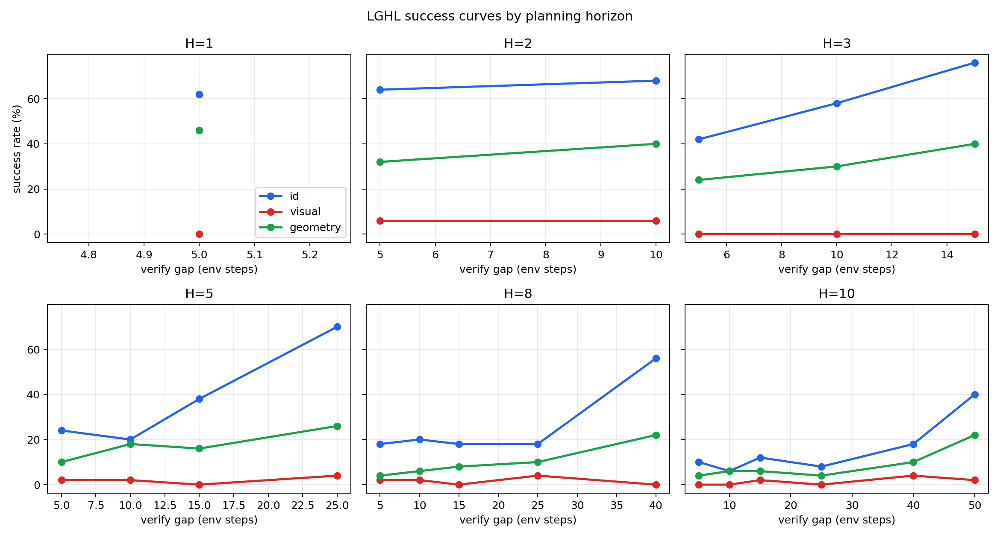
- 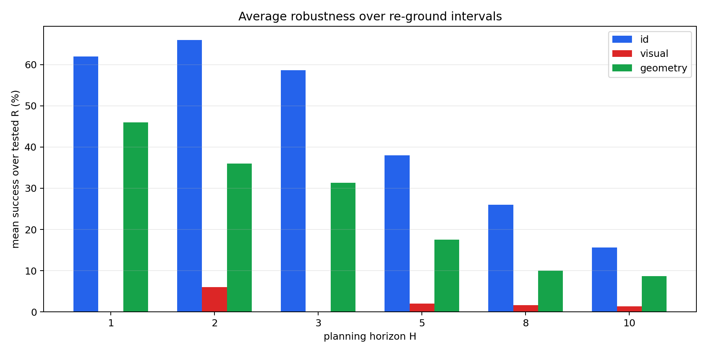
- 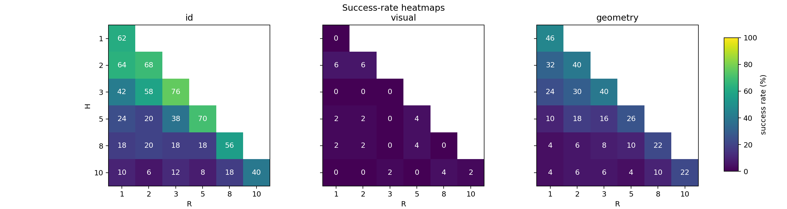

### 结果

整体成功率：

| shift | mean success | min | max | cells |
| --- | ---: | ---: | ---: | ---: |
| ID | 35.52% | 6% | 76% | 21 |
| visual | 1.71% | 0% | 6% | 21 |
| geometry | 18.29% | 4% | 46% | 21 |

按 `H` 聚合：

| H | ID | visual | geometry |
| ---: | ---: | ---: | ---: |
| 1 | 62.00 | 0.00 | 46.00 |
| 2 | 66.00 | 6.00 | 36.00 |
| 3 | 58.67 | 0.00 | 31.33 |
| 5 | 38.00 | 2.00 | 17.50 |
| 8 | 26.00 | 1.60 | 10.00 |
| 10 | 15.67 | 1.33 | 8.67 |

每个 `H` 下最好的 `R`：

| shift | H=1 | H=2 | H=3 | H=5 | H=8 | H=10 |
| --- | --- | --- | --- | --- | --- | --- |
| ID | R1 / 62 | R2 / 68 | R3 / 76 | R5 / 70 | R8 / 56 | R10 / 40 |
| visual | R1 / 0 | R1 / 6 | R1 / 0 | R5 / 4 | R5 / 4 | R8 / 4 |
| geometry | R1 / 46 | R2 / 40 | R3 / 40 | R5 / 26 | R8 / 22 | R10 / 22 |

`R=H` 对角线：

| H=R | ID | visual | geometry |
| ---: | ---: | ---: | ---: |
| 1 | 62% | 0% | 46% |
| 2 | 68% | 6% | 40% |
| 3 | 76% | 0% | 40% |
| 5 | 70% | 4% | 26% |
| 8 | 56% | 0% | 22% |
| 10 | 40% | 2% | 22% |

shift 相对 ID：

| shift | mean delta vs ID | mean ratio vs ID |
| --- | ---: | ---: |
| visual | -33.81 pts | 0.062 |
| geometry | -17.24 pts | 0.523 |

### Phase 1 小结

第一，corrected visual shift 是最严重的 behavior failure。默认 `H=R=5` 下 ID 是 `70%`，visual 只有 `4%`；全表 visual 最好也只有 `6%`。旧版 visual robustness 结论应当删除。

第二，geometry shift 也明显伤害成功率，但没有 visual 那么断崖式。geometry 整体平均 `18.29%`，大约是 ID 的一半；在 `R=H` 对角线仍能达到 `22%-46%`。

第三，ID 和 geometry 不支持简单 monotonic half-life。比如 ID 的 `H=5,R=5` 是 `70%`，而 `H=5,R=1` 只有 `24%`。这说明 success_rate 同时受 latent rollout、CEM 搜索质量、warm-start/action buffer、chunk 长度和 PushT 阶段结构影响。

## Phase 2: Fixed-Trajectory Latent Drift

### 目的

Phase 2 不跑 CEM、不算 success、不让 planner 选动作。它固定真实 expert trajectory 和真实 action，只问：

```text
从真实 observation 编码出的 z_t 出发，
沿真实 action open-loop rollout k 步后，
预测 latent zhat_{t+k} 和真实未来 observation 编码出的 z_{t+k} 差多少？
```

### 设置

```text
script = scripts/plan/latent_drift_phase2.py
policy = quentinll/lewm-pusht
dataset = pusht_expert_train.h5
num_windows = 200
max_k = 10
action_block = 5
seed = 42
shift in {id, visual, geometry}
```

两组 goal offset：

- `goal_offset=25`: 和 Phase 1/default LeWM eval 一致，但 `k=5` 时已经到 goal，长程点有 termination 混杂。
- `goal_offset=50`: control，更适合看长程 latent drift；`k=5` 时还没到 goal，`k=10` 才接近目标点。

每个样本：

1. 从 expert dataset 采样 episode 和起点 `t`。
2. 取真实初始 state `s_t`。
3. 取真实 raw action 序列。
4. 在对应 shift 的 PushT 环境中 reset 到同一初始 state。
5. replay 同一串 raw action，每隔 `action_block=5` 步 render 一帧。
6. 编码真实 observation 得到 `z_{t+k}`。
7. raw action 用 eval 一致的 `StandardScaler` 标准化，每 5 个 env action 拼成一个 10 维 model action。
8. 用 LeWM 从 `z_t` 出发 rollout 得到 `zhat_{t+k}`。
9. 计算 latent distance。

指标：

```text
mse_k = mean((zhat_{t+k} - z_{t+k})^2)
l2_k = ||zhat_{t+k} - z_{t+k}||_2
cosine_k = 1 - cosine_similarity(zhat_{t+k}, z_{t+k})
```

这些都是 latent 空间距离，不是 pixel error。

额外指标 `encoder_shift`：

```text
encoder_shift_k = distance(encode(o^{shift}_{t+k}), encode(o^{id}_{t+k}))
```

它表示同一个 replay step，在 shifted render 和 ID render 下，encoder 输出 latent 差多少。这个指标能区分：

- observation 一进 encoder 就已经偏了；
- 还是初始 encoding 尚可，但 action replay 和 dynamics 让未来状态逐步偏离。

### 输出与图

服务器：

```text
/code/wge/stable-worldmodel/outputs/lghl_phase2_n200_k10
/code/wge/stable-worldmodel/outputs/lghl_phase2_n200_k10_goal50
```

本地：

- [goal25 summary CSV](lghl_phase2_figures/goal25/phase2_latent_drift_summary.csv)
- [goal50 summary CSV](lghl_phase2_figures/goal50/phase2_latent_drift_summary.csv)

主图使用 `goal_offset=50` control：

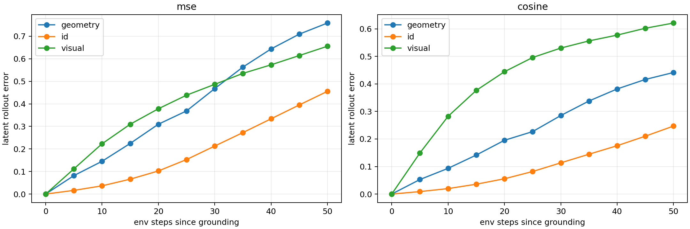

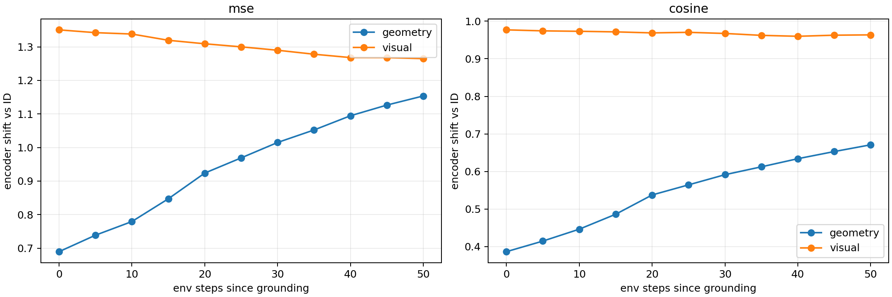

`goal_offset=25` 对照图：

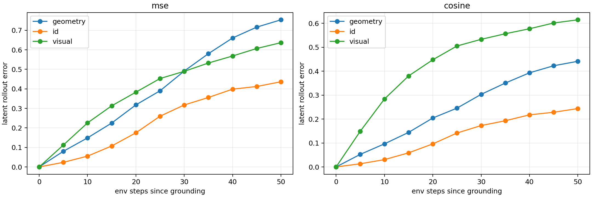

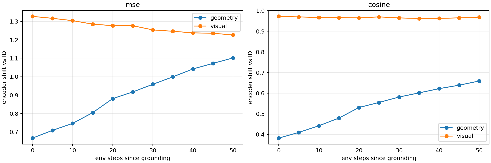

### goal_offset=25 结果

注意：这组和 Phase 1 goal offset 一致，但 ID 和 visual 到 `k=5` 时几乎都已经 terminated，所以 `k>5` 的长程点要谨慎解释。

Rollout latent MSE：

| shift | k=1 / 5 env | k=5 / 25 env | k=10 / 50 env | mean-curve doubling k |
| --- | ---: | ---: | ---: | ---: |
| id | 0.0236 | 0.2600 | 0.4365 | 2 |
| visual | 0.1122 | 0.4530 | 0.6368 | 2 |
| geometry | 0.0801 | 0.3902 | 0.7538 | 3 |

Encoder shift：

| shift | MSE k=0 | MSE k=5 | MSE k=10 | cosine k=0 | cosine k=10 |
| --- | ---: | ---: | ---: | ---: | ---: |
| visual | 1.3276 | 1.2769 | 1.2267 | 0.9721 | 0.9685 |
| geometry | 0.6665 | 0.9172 | 1.1018 | 0.3822 | 0.6591 |

Termination fraction：

| shift | k=5 | k=10 |
| --- | ---: | ---: |
| id | 0.995 | 0.995 |
| visual | 0.995 | 0.995 |
| geometry | 0.400 | 0.410 |

### goal_offset=50 control 结果

这组更适合看长程 latent drift。

Rollout latent MSE：

| shift | k=1 / 5 env | k=5 / 25 env | k=10 / 50 env | mean-curve doubling k |
| --- | ---: | ---: | ---: | ---: |
| id | 0.0163 | 0.1531 | 0.4557 | 2 |
| visual | 0.1116 | 0.4387 | 0.6557 | 3 |
| geometry | 0.0817 | 0.3688 | 0.7586 | 3 |

Encoder shift：

| shift | MSE k=0 | MSE k=5 | MSE k=10 | cosine k=0 | cosine k=10 |
| --- | ---: | ---: | ---: | ---: | ---: |
| visual | 1.3507 | 1.3001 | 1.2649 | 0.9769 | 0.9636 |
| geometry | 0.6896 | 0.9691 | 1.1537 | 0.3865 | 0.6710 |

Termination fraction：

| shift | k=5 | k=10 |
| --- | ---: | ---: |
| id | 0.000 | 0.995 |
| visual | 0.000 | 0.995 |
| geometry | 0.000 | 0.275 |

### Phase 2 小结

第一，ID latent rollout 本身也会漂。`goal_offset=50` 下：

```text
ID MSE: k=1 0.0163 -> k=5 0.1531 -> k=10 0.4557
```

这说明即使不加 shift，LeWM open-loop latent prediction 也有明显累积误差。

第二，visual shift 的主要问题是 encoder 不 invariant。`goal_offset=50` 下，visual encoder-shift 在 `k=0` 就是：

```text
MSE = 1.3507
cosine distance = 0.9769
```

同一个物理 state，只改颜色/背景，encoder 输出 latent 已经和 ID render 差很远。

第三，geometry shift 的 encoder 起点偏移小于 visual，但随 replay 增大：

```text
geometry encoder-shift MSE:
k=0  0.6896
k=5  0.9691
k=10 1.1537
```

这说明 geometry 不只是第一眼看错，而是同一串 action 在不同尺度、形状、接触条件下产生不同未来状态，真实未来 observation 的 latent 逐渐远离 ID。

第四，rollout error 下 visual 和 geometry 都高于 ID，但 temporal profile 不同：

```text
goal_offset=50, k=5:
ID       0.1531
visual   0.4387
geometry 0.3688

goal_offset=50, k=10:
ID       0.4557
visual   0.6557
geometry 0.7586
```

短期 visual 更像 encoder shock；长程 geometry 的 drift 会继续积累，甚至超过 visual。

## Phase 3: Same-State Encoder, Re-grounding, and Geometry Replay Controls

### 目的

Phase 3 是专门为了解 Phase 2 的两个疑问：

第一，visual/geometry 在 Phase 2 的 encoder-shift 用了 rollout 后的真实 observation。对 geometry 来说，这不再是“同一个物理状态换一种 render”，而可能已经变成“同一串 action 在另一个物理环境里走出了另一个未来”。所以 Phase 2 更像 fixed-action stress test，不是纯 same-state invariance test。

第二，Phase 2 里 geometry 的 latent MSE 从 `k=0` 到 `k=10` 增长很快，需要拆开看：这是 encoder 对同一状态越来越不稳，还是 replay dynamics/contact 已经分叉。

因此 Phase 3 拆成三个 control：

- same-state encoder shift：直接取 dataset 的同一个状态 `s_{t+5k}`，分别用 ID/visual/geometry render，再比较 shifted latent 和 ID latent；不 step 环境。
- re-grounded rollout：沿用 Phase 2 的固定 expert action replay，但每隔 `G` 个 model step 用真实 observation 重新 grounding；`G=1` 接近 teacher-forced one-step，`G=10` 对应本实验的 open-loop。
- replay state divergence：保存 replay 的低层状态，比较 shifted replay 和 ID replay/dataset state 的真实物理距离，确认 geometry 是否已经走到了另一个未来。

### 设置

```text
script = scripts/plan/latent_drift_phase3.py
policy = quentinll/lewm-pusht
dataset = pusht_expert_train.h5
num_windows = 200
max_k = 10
goal_offset = 50
action_block = 5
seed = 42
device = cuda
reground_interval = {1, 2, 3, 5, 10}
shift = {id, visual, geometry}
elapsed_sec = 82.64
```

服务器输出：

```text
/code/wge/stable-worldmodel/outputs/lghl_phase3_n200_k10_goal50
```

本地结果：

- summary csv: [phase3_summary.csv](lghl_phase3_figures/goal50/phase3_summary.csv)
- summary json: [phase3_summary.json](lghl_phase3_figures/goal50/phase3_summary.json)
- metadata: [phase3_metadata.json](lghl_phase3_figures/goal50/phase3_metadata.json)

### 输出与图

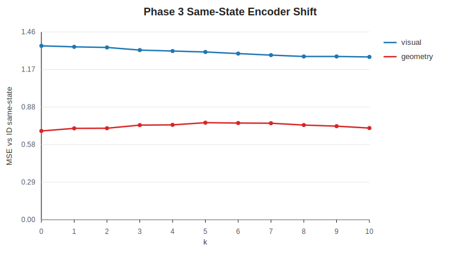

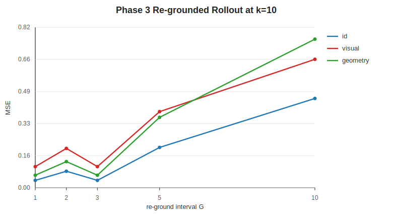

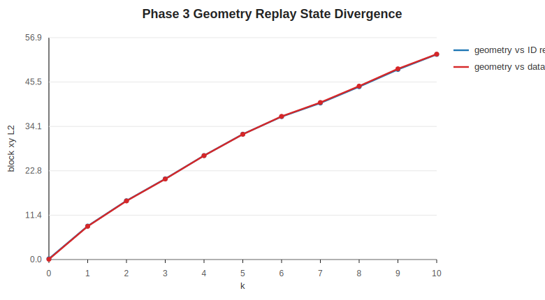

### 结果

Same-state encoder shift，比较的是同一个 dataset state 在不同 render/geometry 设置下的 latent：

| shift | MSE k=0 | MSE k=5 | MSE k=10 | cosine k=0 | cosine k=10 |
| --- | ---: | ---: | ---: | ---: | ---: |
| visual | 1.3507 | 1.3029 | 1.2644 | 0.9769 | 0.9639 |
| geometry | 0.6896 | 0.7538 | 0.7119 | 0.3865 | 0.4438 |

这个表非常关键。visual 的 same-state shift 在 `k=0` 就很大，并且一直很大；geometry 的 same-state MSE 只有约 `0.69-0.75`，没有复现 Phase 2 中 `0.6896 -> 1.1537` 的快速增长。

Re-grounded rollout MSE，`k=10` / 50 env steps：

| shift | G=1 | G=2 | G=3 | G=5 | G=10 |
| --- | ---: | ---: | ---: | ---: | ---: |
| id | 0.0376 | 0.0843 | 0.0376 | 0.2058 | 0.4557 |
| visual | 0.1078 | 0.2007 | 0.1078 | 0.3884 | 0.6557 |
| geometry | 0.0638 | 0.1336 | 0.0638 | 0.3593 | 0.7586 |

这里 `G=3` 在 `k=10` 和 `G=1` 相同，是因为 `k=10` 正好只离最近一次 grounding 一个 model step；所以不要单独过度解释这个 cell。整体趋势仍然清楚：`G=1/2` 明显压住误差，`G=5/10` 开始显著 open-loop compounding。

Teacher-forced `G=1` 的 `k=1..10` 平均 MSE：

| shift | mean MSE | k=1 | k=5 | k=10 |
| --- | ---: | ---: | ---: | ---: |
| id | 0.0238 | 0.0163 | 0.0241 | 0.0376 |
| visual | 0.1092 | 0.1116 | 0.1076 | 0.1078 |
| geometry | 0.0730 | 0.0817 | 0.0806 | 0.0638 |

这说明 Phase 2 的 open-loop 大 MSE 里确实有很强的 compounding 成分。ID 从 `G=10` 的 `0.4557` 降到 `G=1` 的 `0.0376`；geometry 从 `0.7586` 降到 `0.0638`。visual 即便 teacher-forced 也有约 `0.108`，说明 visual 的问题不是单纯 compounding，而是 encoder shock 已经存在。

Geometry replay state divergence：

| comparison | block xy L2 k=0 | block xy L2 k=5 | block xy L2 k=10 |
| --- | ---: | ---: | ---: |
| geometry vs ID replay | 0.1986 | 32.1706 | 52.6279 |
| geometry vs dataset state | 0.0708 | 32.1227 | 52.6992 |

geometry 的 agent path 基本相同，但 block/contact 已经明显分叉。也就是说 Phase 2 里的 geometry long-horizon drift 很大一部分不是“同一个状态的 encoder 越来越坏”，而是“同一串 action 在 geometry-shift 后真的走到了另一个 block state”。

### Phase 3 小结

第一，Phase 2 的 visual 结论仍然成立，而且更明确：visual 是 same-state encoder shock。只换颜色/背景、不换物理状态，latent MSE 立刻约 `1.35`。

第二，Phase 2 对 geometry 的解释需要修正。geometry same-state encoder 偏移存在，但没有一个数量级式增长；此前 `k=10` 的大增长主要混入了 replay dynamics/contact divergence。

第三，latent MSE 增长快这件事是真的，但来源分两类：ID/geometry 的 long-horizon 大误差主要是 open-loop compounding 和 replay 分叉；visual 的 one-step/teacher-forced 误差本来就高，所以 re-grounding 只能缓解 compounding，不能修复 encoder 不变性。

第四，Phase 2 的测试方式不是无效，但它回答的问题要重新命名：它不是纯 FoV same-state invariance，而是 fixed-action future consistency under shift。Phase 3 才是把 same-state encoder、open-loop compounding、physics divergence 分开的 control。

## Phase 4: Contact/Event, Warm-Start, and Latent-to-Action-Quality Controls

### 目的

Phase 4 回答三个问题：

第一，geometry 的物理分叉是不是发生在接触附近，还是没有接触前就已经无关地漂走了。

第二，Phase 1 中 `R=H` 经常最好，是否只是 `warm_start=true` 的 action buffer / CEM 计划继承造成的假象。

第三，latent MSE 到底有没有改变 LeWM planner 真正优化的 action cost landscape。换句话说，latent gap 不只要看数值大不大，还要看同一批 candidate action 在 true/re-grounded latent 和 drifted latent 下的排序是否一致。

### 设置

脚本：

```text
scripts/plan/geometry_contact_phase4.py
scripts/plan/latent_action_quality_phase4.py
scripts/plan/lghl_warm_start_ablation.py
scripts/plan/run_phase4_suite_remote.sh
```

服务器输出：

```text
/code/wge/stable-worldmodel/outputs/lghl_phase4_contact_n200_goal50
/code/wge/stable-worldmodel/outputs/lghl_phase4_action_quality_n100_c256_goal50
/code/wge/stable-worldmodel/outputs/lghl_phase4_warm_start_n50
```

本地结果：

- contact summary: [phase4_contact_summary.csv](lghl_phase4_figures/contact/phase4_contact_summary.csv)
- action quality summary: [phase4_action_quality_summary.csv](lghl_phase4_figures/action_quality/phase4_action_quality_summary.csv)
- warm start summary: [phase4_warm_start_ablation.csv](lghl_phase4_figures/warm_start/phase4_warm_start_ablation.csv)

Contact/event 设置：

```text
num_windows = 200
max_env_steps = 50
goal_offset = 50
action_block = 5
shift = {id, geometry}
```

Action-quality 设置：

```text
num_windows = 100
max_k = 10
eval_k = {1, 3, 5, 10}
plan_horizon = 5
num_candidates = 256
candidate_scale = 1.0
shift = {id, visual, geometry}
```

Warm-start 设置：

```text
num_eval = 50
H = 5
R = {1, 3, 5}
warm_start = {true, false}
goal_offset = 25
eval_budget = 50
```

Action-quality 的比较方式是：对同一个 planning state，构造同一批 candidate action sequences；用 true/re-grounded latent 打分得到 `true_costs`，用 open-loop drifted latent 打分得到 `drift_costs`。这里的 `true_cost_regret` 是：

```text
true_cost(drifted latent 选中的 candidate)
- true_cost(true latent 选中的 candidate)
```

注意这仍然是 LeWM latent cost 下的 regret，不是真实环境 return regret。

### 输出与图

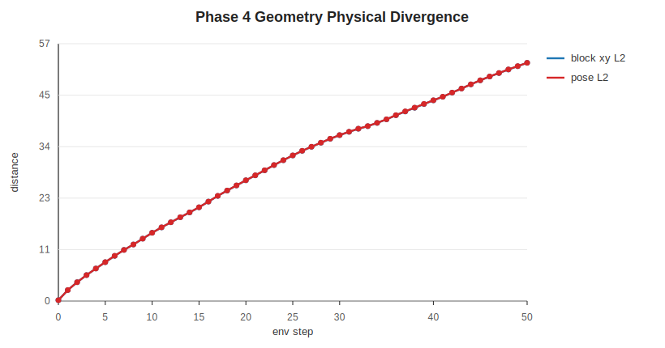

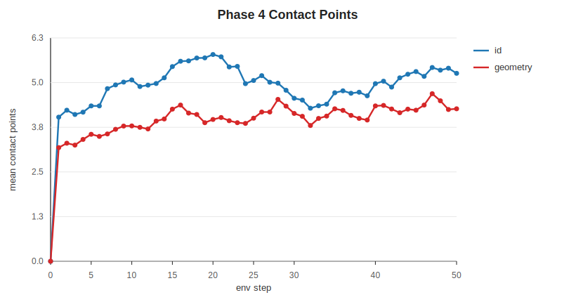

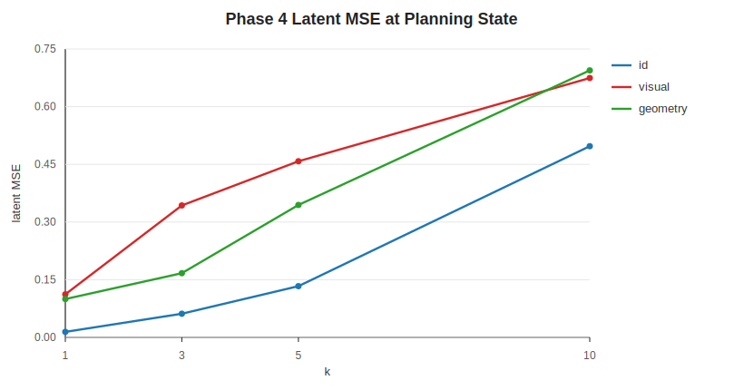

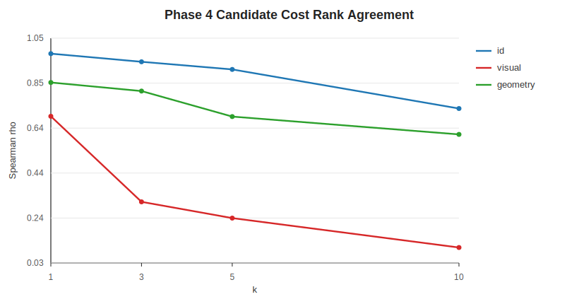

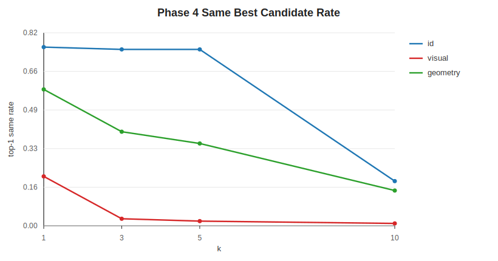

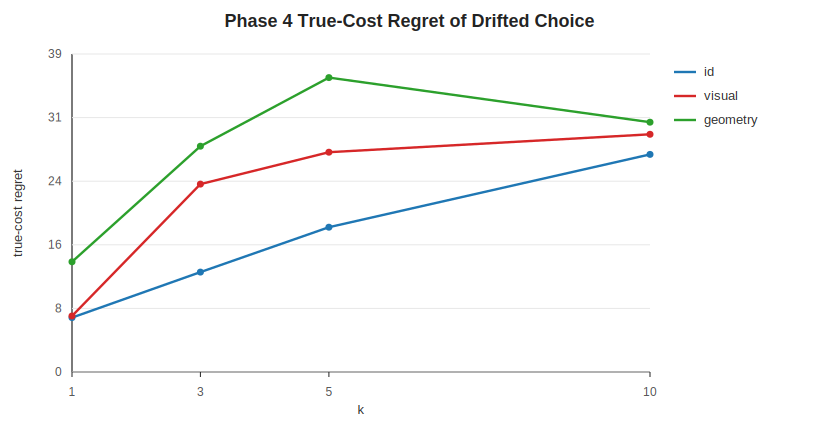

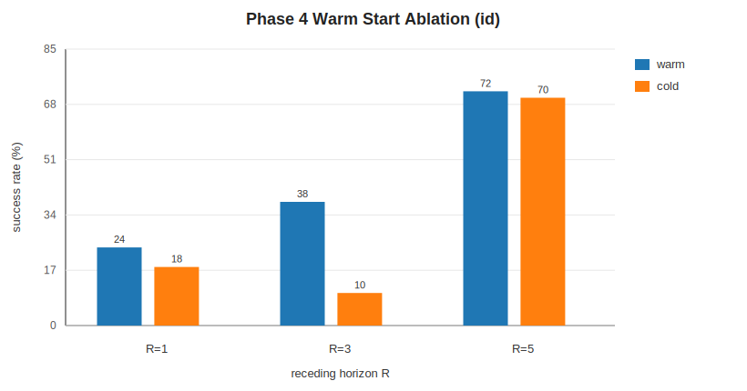

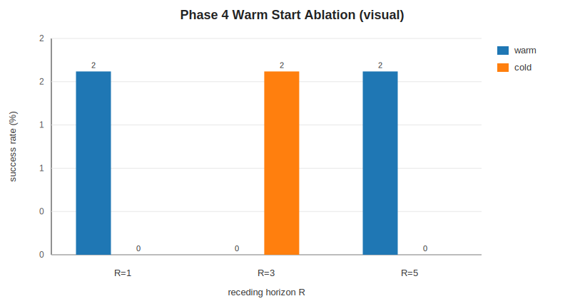

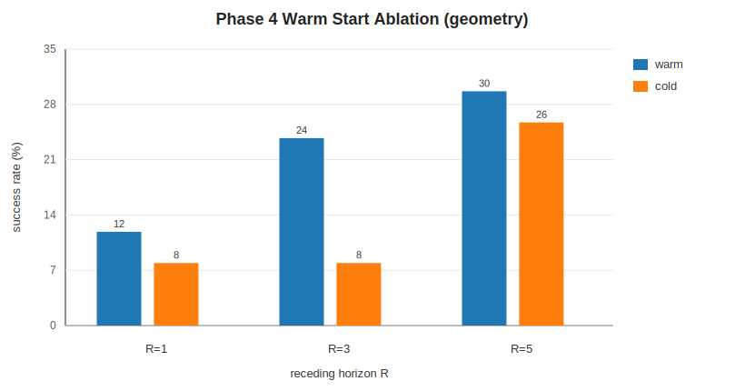

### 结果

Geometry contact/event：

| metric | valid fraction | mean env step | median env step | p25 | p75 |
| --- | ---: | ---: | ---: | ---: | ---: |
| ID first contact | 0.965 | 9.97 | 4.0 | 1.0 | 16.0 |
| geometry first contact | 0.870 | 12.99 | 9.0 | 1.0 | 21.75 |
| first block divergence >= 5 px | 0.855 | 11.49 | 6.0 | 2.0 | 18.0 |
| first block divergence >= 20 px | 0.710 | 17.25 | 14.5 | 6.0 | 26.75 |

Geometry-vs-ID replay 的 block xy divergence：

| env step | k | mean block xy L2 | median | p75 |
| ---: | ---: | ---: | ---: | ---: |
| 0 | 0 | 0.20 | 0.00 | 0.00 |
| 5 | 1 | 8.59 | 2.09 | 15.06 |
| 10 | 2 | 15.09 | 6.10 | 25.00 |
| 25 | 5 | 32.17 | 21.28 | 47.61 |
| 50 | 10 | 52.63 | 39.04 | 77.22 |

这说明 geometry 分叉不是只在 `k=5/10` 才突然出现，而是在接触早期就开始。中位数上，block 超过 `5 px` 分叉发生在 env step `6`，超过 `20 px` 发生在 env step `14.5`；这和 first contact 的时间尺度相近。

Action-quality：

| shift | k | latent MSE | cost Spearman | top-1 same | first action-block L2 | true-cost regret |
| --- | ---: | ---: | ---: | ---: | ---: | ---: |
| id | 1 | 0.014 | 0.979 | 0.760 | 1.06 | 6.70 |
| id | 5 | 0.133 | 0.908 | 0.750 | 0.88 | 17.85 |
| id | 10 | 0.498 | 0.731 | 0.190 | 3.42 | 26.81 |
| visual | 1 | 0.112 | 0.696 | 0.210 | 3.36 | 6.90 |
| visual | 5 | 0.459 | 0.236 | 0.020 | 4.27 | 27.08 |
| visual | 10 | 0.676 | 0.103 | 0.010 | 4.41 | 29.29 |
| geometry | 1 | 0.100 | 0.849 | 0.580 | 1.92 | 13.58 |
| geometry | 5 | 0.345 | 0.695 | 0.350 | 2.82 | 36.28 |
| geometry | 10 | 0.696 | 0.614 | 0.150 | 3.88 | 30.78 |

这个表把 latent gap 接到了 planner objective。ID 自己到 `k=10` 时 cost ranking 也明显变差；visual 在 `k=1` 就已经让 candidate ranking 明显不一致，到 `k=5/10` 基本 top-1 不同；geometry 的 ranking degradation 比 visual 慢，但 regret 在 `k=5` 已经很大。

Warm-start ablation：

| shift | warm_start | R=1 | R=3 | R=5 |
| --- | --- | ---: | ---: | ---: |
| id | true | 24.0 | 38.0 | 72.0 |
| id | false | 18.0 | 10.0 | 70.0 |
| visual | true | 2.0 | 0.0 | 2.0 |
| visual | false | 0.0 | 2.0 | 0.0 |
| geometry | true | 12.0 | 24.0 | 30.0 |
| geometry | false | 8.0 | 8.0 | 26.0 |

Warm-start 确实影响 behavior curve，尤其 `R=3`：ID 从 cold `10%` 到 warm `38%`，geometry 从 cold `8%` 到 warm `24%`。但是 `R=5` 的峰值在 cold 下仍然存在：ID cold `70%`，geometry cold `26%`。所以 `R=H` 好不只是 warm-start；它还混入了 replan frequency、CEM 搜索稳定性、action chunk/task phase 等因素。Visual 则无论 warm/cold 都基本失败。

### Phase 4 小结

第一，geometry 的物理分叉和接触事件在同一时间尺度上发生。它不是一个纯 representation drift 问题，而是真实 dynamics/contact 在 shift 后早期就分叉。

第二，latent drift 确实会改变 LeWM planner 的 candidate cost landscape。visual 是最极端的：`k=5` 时 cost Spearman 只有 `0.236`，top-1 same 只有 `0.02`。geometry 到 `k=5` 时 Spearman 仍有 `0.695`，但 true-cost regret 已经达到 `36.28`。

第三，ID 自身也有 action-quality half-life。ID `k=10` 的 latent MSE 是 `0.498`，top-1 same 只有 `0.19`，说明即使不加 FoV shift，open-loop latent 走太久也会让 planner objective 明显变形。

第四，behavior-level LGHL 进一步确认不是纯 latent half-life。Warm-start 改变成功率，尤其影响中等 `R`；但 `R=H` 峰值不完全由 warm-start 解释。

## Phase 5: ID Long-Horizon Planning Diagnostics

### 目的

Phase 5 先只看 `id`，暂时不救 `visual` 或 `geometry`。核心问题是：

```text
LeWM 在自己训练分布里，open-loop latent reasoning 是否足够稳定到能支撑更长 planning？
```

这里要把三个因素拆开：

第一，短 horizon 是否因为 terminal-only cost 太近视，无法给接近、接触、推动这些早期动作正确 credit。

第二，长 horizon 是否因为 open-loop latent drift 和 CEM 搜索维度增加而坏。

第三，behavior success 和 planner-relevant latent accuracy 之间到底怎么对应。也就是说，不只问 latent MSE 是否变大，还要问 candidate action ranking、top action、regret 是否变坏。

### 设置

新增脚本：

```text
scripts/plan/lghl_phase5_id_behavior.py
scripts/plan/run_phase5_id_suite_remote.sh
```

第一组：horizon-vs-goal-offset alignment。

```text
shift = id
goal_offset = {5, 10, 15, 25, 50}
H = R = {1, 2, 3, 5, 8, 10}
action_block = 5
warm_start = true
num_eval = 50
eval_budget = 50
```

这组专门解释为什么 `H=R=1/2` 不如 `H=R=3/5`。如果最优 `H` 随 `goal_offset` 移动，说明短 horizon 的问题主要是 credit horizon mismatch；如果不移动，说明还有 CEM/action chunk/latent dynamics 的机制问题。

第二组：`H=5` warm/cold receding comparison。

```text
shift = id
goal_offset = 25
H = 5
R = {1, 2, 3, 5}
warm_start = {true, false}
```

这组保留 Phase 4 的 warm-start control，但增加 richer behavior metrics。

第三组：ID action-quality frontier。

```text
shift = id
k = 0..10
plan_horizon = {1, 2, 3, 5}
num_candidates = 256
goal_offset = 50
```

这组沿用 Phase 4 的 latent-to-action-quality 方法，但只看 ID，并把 `k` 和 `plan_horizon` 做细。

### 输出与图

Remote run：

```text
server: fnii-vla2
repo: /code/wge/stable-worldmodel
gpu: CUDA_VISIBLE_DEVICES=7
out_root: outputs/lghl_phase5_id_diagnostics_run_20260617_1709
```

Local copied artifacts：

```text
docs/knowledge/lghl_phase5_figures/behavior_alignment/
docs/knowledge/lghl_phase5_figures/behavior_h5_warmcold/
docs/knowledge/lghl_phase5_figures/action_quality_plan_h{1,2,3,5}/
```

Compact tables：

```text
docs/knowledge/lghl_phase5_figures/phase5_alignment_compact.csv
docs/knowledge/lghl_phase5_figures/phase5_warmcold_compact.csv
docs/knowledge/lghl_phase5_figures/phase5_action_quality_frontier.csv
```

Figures：

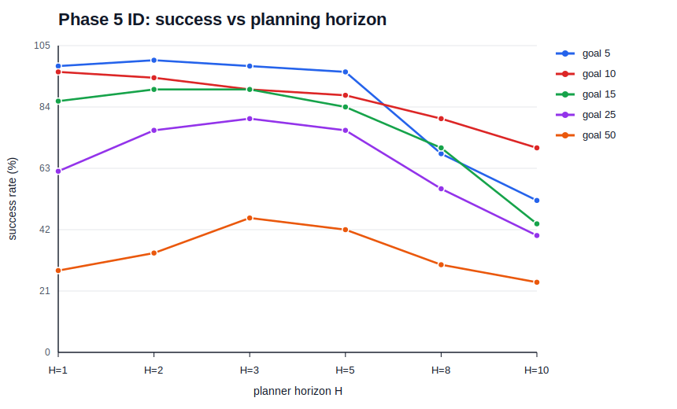

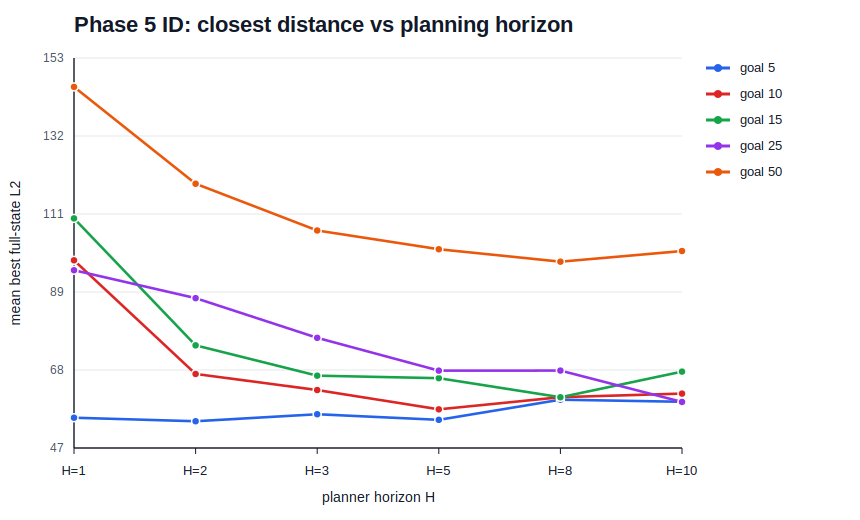

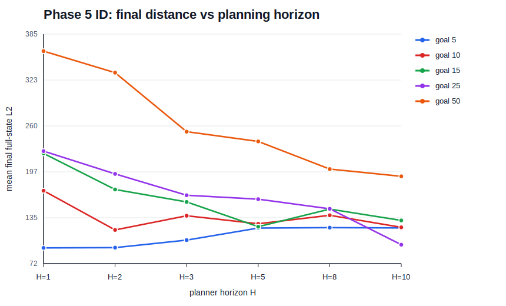

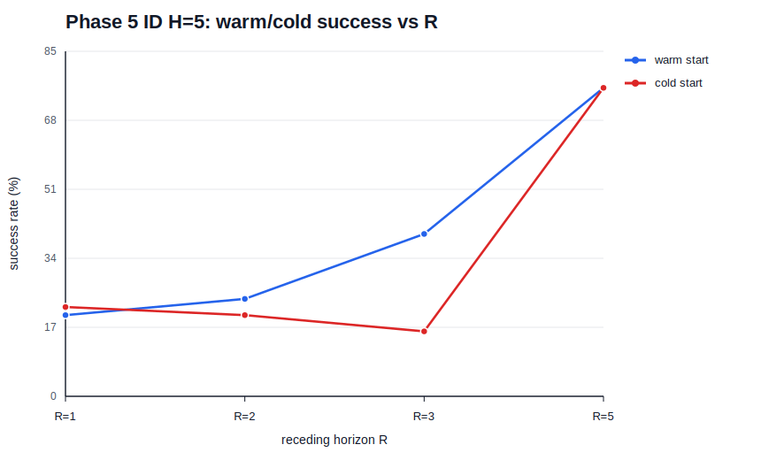

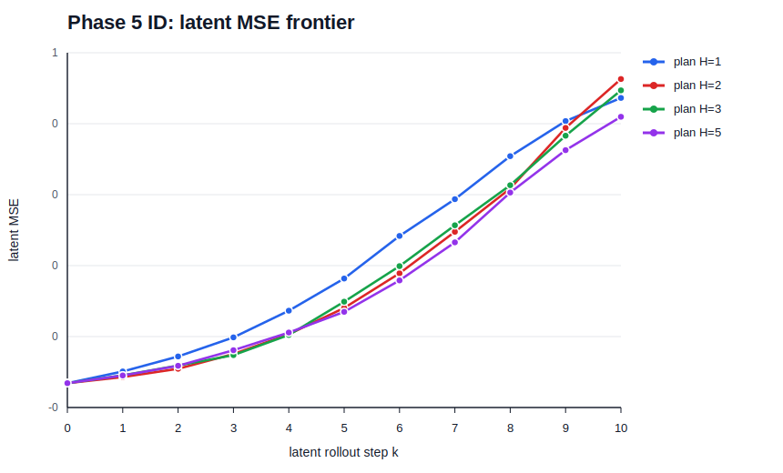

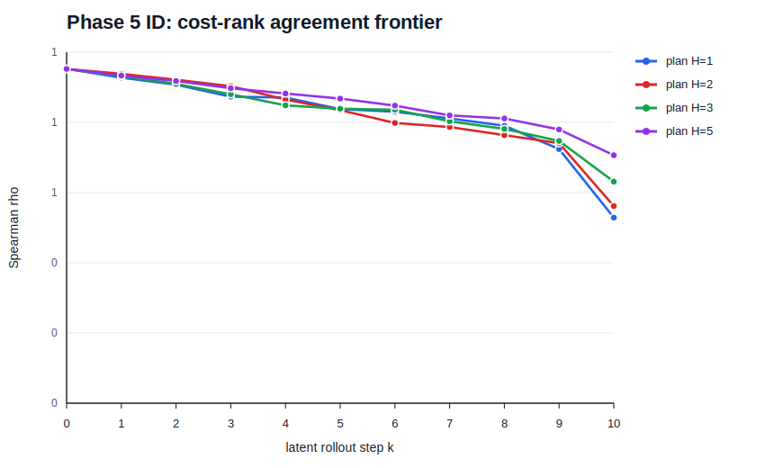

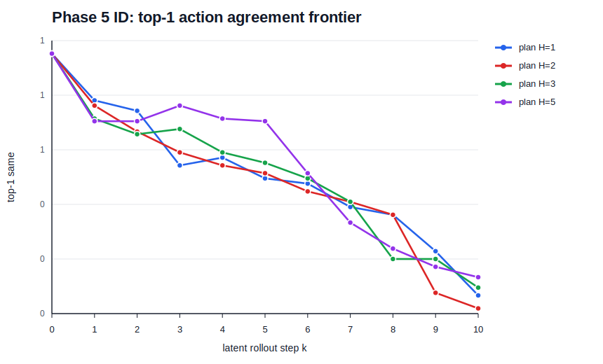

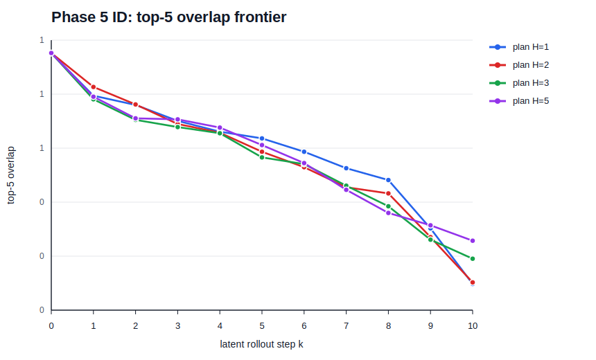

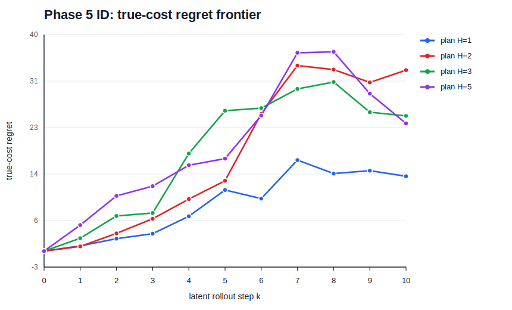

### 结果 1: horizon-vs-goal-offset alignment

Success rate：

| goal_offset | H=1 | H=2 | H=3 | H=5 | H=8 | H=10 | best H |
|---:|---:|---:|---:|---:|---:|---:|---:|
| 5 | 98% | 100% | 98% | 96% | 68% | 52% | 2 |
| 10 | 96% | 94% | 90% | 88% | 80% | 70% | 1 |
| 15 | 86% | 90% | 90% | 84% | 70% | 44% | 2/3 |
| 25 | 62% | 76% | 80% | 76% | 56% | 40% | 3 |
| 50 | 28% | 34% | 46% | 42% | 30% | 24% | 3 |

Mean best full-state L2 distance：

| goal_offset | H=1 | H=2 | H=3 | H=5 | H=8 | H=10 |
|---:|---:|---:|---:|---:|---:|---:|
| 5 | 55.5 | 54.5 | 56.4 | 54.9 | 60.4 | 59.8 |
| 10 | 98.0 | 67.3 | 63.0 | 57.8 | 61.1 | 62.0 |
| 15 | 109.3 | 75.0 | 66.9 | 66.2 | 61.0 | 67.9 |
| 25 | 95.3 | 87.8 | 77.1 | 68.2 | 68.2 | 59.8 |
| 50 | 144.8 | 118.7 | 106.1 | 101.0 | 97.6 | 100.5 |

这个结果解释了之前觉得奇怪的点：在默认 `goal_offset=25` 附近，`H=1/2` 确实不如 `H=3/5`，因为 terminal-only objective 对早期“靠近、接触、推动”的 credit 太短。但这个现象不是简单的“更长 H 一定更好”：短 goal 下 `H=1/2` 反而最好，长 goal 下最优也只移动到 `H=3/5`，`H=8/10` 的 success 明显掉。

也就是说，Phase 5 支持：

```text
H too short -> credit horizon mismatch
H too long  -> open-loop latent drift + larger CEM search space + delayed real grounding
```

Success 和 distance 还出现分离。比如 `goal_offset=25` 时 `H=10` 的 mean best distance 最低 `59.8`，但 success 只有 `40%`；`goal_offset=50` 时 `H=8/10` 的 final/best distance 比短 horizon 更好，但 success 不如 `H=3`。所以后续不能只看二值 success，也要看 closest approach、final distance、time-to-success 这类连续指标。

### 结果 2: H=5 warm/cold receding comparison

固定 `goal_offset=25, H=5`：

| R | warm success | cold success | warm best dist | cold best dist |
|---:|---:|---:|---:|---:|
| 1 | 20% | 22% | 85.4 | 80.5 |
| 2 | 24% | 20% | 74.8 | 75.7 |
| 3 | 40% | 16% | 66.4 | 70.0 |
| 5 | 76% | 76% | 68.2 | 68.2 |

`R=5` 时 warm/cold 完全一样，是因为 `R=H` 执行完整计划后没有剩余 action buffer 可以继承，warm-start 实际无效。`R=1/2` 虽然更频繁看真实 observation，但 success 很低；`R=3` 只有 warm-start 明显救回来一部分；`R=5` 最高。

所以这里不能读成“少 grounding 本身更好”。更准确是：在当前 planner/objective/action chunk 组合下，频繁 replanning 会让 terminal-only cost 更难给短局部动作正确 credit；同时 warm-start 会改变 CEM 的连续性。Behavior-level LGHL 混入了 planner execution mechanics。

### 结果 3: ID action-quality frontier

先看默认 `plan_horizon=5` 的代表点：

| k | latent MSE | Spearman | top1 same | top5 overlap | regret | first-block L2 |
|---:|---:|---:|---:|---:|---:|---:|
| 0 | 0.000 | 1.000 | 1.00 | 1.00 | 0.0 | 0.00 |
| 1 | 0.014 | 0.980 | 0.74 | 0.83 | 4.8 | 1.15 |
| 2 | 0.033 | 0.964 | 0.74 | 0.75 | 10.2 | 1.12 |
| 3 | 0.062 | 0.942 | 0.80 | 0.74 | 12.0 | 0.78 |
| 5 | 0.133 | 0.911 | 0.74 | 0.64 | 17.0 | 1.05 |
| 8 | 0.356 | 0.852 | 0.25 | 0.38 | 36.7 | 3.27 |
| 10 | 0.498 | 0.742 | 0.14 | 0.27 | 23.5 | 3.43 |

再看 `k=10` 时不同 action-quality plan horizon：

| plan_horizon | latent MSE | Spearman | top1 same | top5 overlap | regret |
|---:|---:|---:|---:|---:|---:|
| 1 | 0.533 | 0.555 | 0.07 | 0.10 | 13.8 |
| 2 | 0.569 | 0.590 | 0.02 | 0.11 | 33.3 |
| 3 | 0.548 | 0.663 | 0.10 | 0.20 | 24.9 |
| 5 | 0.498 | 0.742 | 0.14 | 0.27 | 23.5 |

这里最重要的不是 latent MSE 单调变坏，而是 downstream action choice 的可容忍区间。`k=5` 的 latent 已经漂了，但在 `plan_horizon=5` 下 cost ranking 还保持 `0.911` Spearman，top1 same 还有 `0.74`，top5 overlap 还有 `0.64`。这解释了为什么“latent k=5 坏得明显”不一定让 `H=5` behavior 立刻坏掉：CEM 不是只靠 latent reconstruction，也不是只看唯一 top action；weighted candidate selection、top-k neighborhood、replanning 都会提供容忍度。

但到 `k=8/10`，top action 和 top-k neighborhood 明显塌掉。`plan_horizon=5, k=10` 的 top1 same 只有 `0.14`，top5 overlap 只有 `0.27`；`plan_horizon=1/2` 下 top1 same 更低到 `0.07/0.02`。所以 ID 内部确实存在 long-horizon open-loop action-quality half-life，只是 behavior-level 成功率不是这个 half-life 的直接单变量读数。

### Phase 5 小结

第一，原来 `H=R=1/2` 不如 `3/5` 并不神秘。默认 `goal_offset=25` 需要足够长的 horizon 才能让 terminal-only cost 给早期动作 credit；短 goal 下 `H=1/2` 本来就很强。

第二，ID drift 已经足够严重，值得先作为 Phase 6 的核心问题。`k=10` 时 ID 的 top1/top5 action agreement 已经很低，说明即使没有 visual/geometry shift，open-loop latent reasoning 也不是稳定无限外推。

第三，`H=5` 当前像是一个经验折中点：比 `H=1/2` 更能处理 default longer goal，又没有 `H=8/10` 那么明显进入 long open-loop/search degradation。

第四，后续方法应该先解决 ID setting 下的 latent planning stability，再谈 visual/geometry 的 specific rescue。否则 visual/geometry 的改进会混入更基础的 ID open-loop 问题。

## Phase 6: Latent Drift Error-Vector Structure

### 目的

Phase 2–5 只回答了 latent drift "有多大"（MSE / L2 / cosine / cost-rank / regret），从没回答它 "怎么漂"。Phase 6 把误差向量

```text
delta_k = zhat_k - z_k
```

的结构拆开，目的是在进入 "解决" 阶段前先把方案空间收窄。核心要分清四件事：

第一，bias vs diffusion。误差能量里有多少是所有样本共享的一致方向偏移 `E[delta]`，有多少是逐样本散布。bias 占比高，说明一个全局校正向量就能修掉大部分（最便宜）；diffusion 占主导，说明只能靠更频繁 re-grounding 或 uncertainty-aware planning。

第二，维度集中度。误差集中在少数 latent 维（participation ratio 小、top-10 维占比高），还是摊在全部 192 维。

第三，norm 行为。`zhat` 是塌向某个均值/prior（norm ratio < 1）还是相对真实 latent 膨胀（> 1）。

第四，自然尺度归一。把 drift 和 encoder-shift 都除以真实 ID latent 的天然散布，让 "MSE = 0.5" 变得可解释。

### 设置

Phase 6 是对 Phase 3 已存盘 rollout latent 的纯后处理，不重跑 render/encode/rollout，因此复用完全相同的 `n=200, seed=42, goal_offset=50` 窗口，结构数字与 Phase 2/3 的幅度数字直接可比、且不引入新采样噪声。

```text
script = scripts/plan/latent_drift_structure_phase6.py
输入   = outputs/lghl_phase3_n200_k10_goal50/phase3_{shift}_replay_outputs.npz
         outputs/lghl_phase3_n200_k10_goal50/phase3_{shift}_same_state_embeddings.npz
latent = pooled emb, D = 192
intervals = {1,2,3,5,10}  (10 = pure open-loop)
shift  = {id, visual, geometry}
elapsed = 0.4 sec
```

定义（均按 mean-over-dim 口径，和 Phase 3 的 mse 一致）：

```text
E_total      = mean_n( mean_d delta_d^2 )                 总误差能量
E_bias       = mean_d( (mean_n delta_d)^2 )               一致偏移能量
bias_fraction= E_bias / E_total                           一致偏移占比 in [0,1]
participation_ratio (PR) = 1 / sum_d(qhat_d^2),  qhat_d ∝ mean_n delta_d^2   in [1,192]
natural_spread = mean_d( var_n(z_d) )                     真实 latent 天然散布
drift_over_spread = E_total / natural_spread
norm_ratio   = mean_n||zhat|| / mean_n||z||
```

### 输出

- summary CSV: [phase6_structure_summary.csv](lghl_phase6_figures/phase6_structure_summary.csv)
- summary JSON: [phase6_structure_summary.json](lghl_phase6_figures/phase6_structure_summary.json)

本 phase 数字足够紧凑，直接用表，不单独出图。

### 结果

Open-loop（interval=10）drift 结构：

| shift | k | mse | drift/spread | bias_frac | PR | top10_dim_share | norm_ratio | bias_cos_adj |
| --- | ---: | ---: | ---: | ---: | ---: | ---: | ---: | ---: |
| id | 1 | 0.0163 | 0.017 | 0.039 | 185.3 | 0.074 | 1.000 | — |
| id | 5 | 0.1531 | 0.169 | 0.035 | 182.1 | 0.078 | 1.032 | 0.951 |
| id | 10 | 0.4557 | 0.556 | 0.096 | 177.6 | 0.090 | 1.052 | 0.982 |
| visual | 1 | 0.1116 | 0.360 | 0.104 | 172.1 | 0.098 | 0.966 | — |
| visual | 5 | 0.4387 | 1.408 | 0.125 | 159.4 | 0.125 | 1.093 | 0.996 |
| visual | 10 | 0.6557 | 2.031 | 0.103 | 165.4 | 0.116 | 1.226 | 0.995 |
| geometry | 1 | 0.0817 | 0.098 | 0.016 | 178.6 | 0.092 | 0.989 | — |
| geometry | 5 | 0.3688 | 0.466 | 0.011 | 183.8 | 0.074 | 1.030 | 0.934 |
| geometry | 10 | 0.7586 | 0.938 | 0.013 | 183.3 | 0.077 | 1.044 | 0.954 |

Same-state encoder-shift 按天然散布归一（k=0，零 rollout）：

| shift | mse | shift/spread | bias_frac | PR |
| --- | ---: | ---: | ---: | ---: |
| visual | 1.3507 | 1.410 | 0.082 | 179.3 |
| geometry | 0.6896 | 0.720 | 0.022 | 183.1 |

ID re-grounding dose-response @ `k=10`（结构是否随 grounding 变，还是只变幅度）：

| interval | mse | drift/spread | bias_frac | PR | norm_ratio |
| ---: | ---: | ---: | ---: | ---: | ---: |
| 1 | 0.0376 | 0.046 | 0.082 | 179.3 | 1.008 |
| 2 | 0.0843 | 0.103 | 0.096 | 178.7 | 1.017 |
| 3 | 0.0376 | 0.046 | 0.082 | 179.3 | 1.008 |
| 5 | 0.2058 | 0.251 | 0.100 | 177.8 | 1.040 |
| 10 | 0.4557 | 0.556 | 0.096 | 177.6 | 1.052 |

（`interval=1` 和 `3` 在 `k=10` 相同，是 Phase 3 已说明的 `k=10` 恰好离最近一次 grounding 一个 model step 的 artifact。）

### Phase 6 小结

第一，drift 是 diffusion，不是 bias。`bias_fraction` 在所有 shift/所有 k 上只有 `0.04–0.13`，即 ≥87% 的误差能量是逐样本随机散布，不是共享偏移。含义：一个全局校正向量最多修掉约一成。需要注意一个细节——那一小撮 bias 成分方向却很稳定（`bias_cos_adj` 0.93–0.98），即存在一个小而连贯、可学习的漂移方向，但只占一成能量。

第二，误差摊在几乎全部维度。PR ≈ `177–185 / 192`，top-10 维只占 `7–12%`。没有 "几个坏维度" 可定点修，低秩/维度定向修复不适用。

第三，是轻微膨胀不是塌缩。`norm_ratio` 始终 ≥1 且随 k 增大（id 1.00→1.05，visual →1.23）。predictor 没有塌向 prior，反而轻微外扩，visual 最明显。mode-collapse 类修法不对症。

第四，自然尺度归一把 "偏多少" 讲清楚了。ID open-loop `k=10` 是天然散布的 `0.56×`（明显但仍比随机状态近）；visual `k=10` 达 `2.03×`（比两个随机状态还远，基本去相关）；visual 同状态 `k=0` 就已 `1.41×`，只改颜色就把 latent 推出全体 ID 状态的天然散布之外，这是 "visual encoder 基本失效" 最干净的定量陈述；geometry 同状态 `k=0` 是 `0.72×`，中等未超散布。

第五，re-grounding 只压幅度不改结构。ID `k=10` 把 interval 10→1，mse `0.456→0.038`（12×），但 `bias_fraction`、`PR` 几乎不变。因为误差是扩散型，频繁 grounding 等于重置随机游走，是 ID drift 最有效的杠杆，但不会把问题变成某种结构性修法能利用的形态。

## Phase 7: Manifold Geometry, Projection Recovery, Lag, and Multi-Seed Error Bars

### 目的

Phase 6 给出 drift 的结构(各向同性扩散)后,idea 讨论里提出一个假设:扩散把预测 latent 推**离数据流形**,而最自然的解药是一个把预测**投影回流形**的"恢复力"(离散/码本世界模型背后的机制)。Phase 7 用四个实验验证这条假设,同时补上 Phase 6 缺的统计严谨性:

- E: 多 seed、n=600 重跑 Phase 3 rollout,给 Phase 6 的结构数字加误差棒。
- B: 从 22k ID latent 建流形,测各向异性、PCA 有效维,并把已存 open-loop drift 做"切向/法向(off-manifold)分解"与训练无关投影恢复。
- C: 把投影接到 planner——投影后的 latent 重新给 candidate 打分,看 cost ranking 是否恢复(决策层检验)。
- F: ID 的 on-manifold 漂移到底是"滞后/迟钝预测"还是"错误分支"。

### 设置

```text
机器       = fnii-vla2, GPU 3/5/6/7
脚本       = scripts/plan/latent_manifold_phase7.py            (B)
             scripts/plan/latent_action_quality_projection_phase7.py (C)
             scripts/plan/latent_drift_lag_phase7.py           (F)
             scripts/plan/latent_drift_phase3.py (复用, n=600)  (E)
E: num_samples=600, seeds={0,1,2}, goal_offset=50, max_k=10
B: bank=22000 (2000 windows x 11 ID-rendered states), pca_ds, knn_m=8
C: num_samples=150, num_candidates=256, plan_horizon=5, eval_k={1,5,10},
   投影 = {pca20, pca50, knnsoft0.3, knnsoft0.6, knnsnap}, bank=ID 22k
F: 对 open-loop zhat_k 找同窗口内最近的真实 z_j, offset=argmin_j - k
```

投影只用一个**通用 ID latent bank**(别的轨迹的 ID 状态),从不偷看该样本的真实未来 z_k,所以是合法的 test-time 操作。

### 输出

- manifold: [phase7_manifold_summary.csv](lghl_phase7_figures/phase7_manifold_summary.csv)
- action-proj: [phase7_action_proj_summary.csv](lghl_phase7_figures/phase7_action_proj_summary.csv)
- lag: [phase7_lag_summary.csv](lghl_phase7_figures/phase7_lag_summary.csv)
- 多 seed 结构聚合: [phase6_multiseed_n600_agg.txt](lghl_phase7_figures/phase6_multiseed_n600_agg.txt)

### 结果 E: 多 seed 结构误差棒(n=600 × 3 seeds,open-loop k=10)

| shift | mse | drift/spread | bias_frac | PR |
| --- | ---: | ---: | ---: | ---: |
| id | 0.494 ± 0.011 | 0.599 ± 0.014 | 0.081 ± 0.002 | 180.9 ± 0.4 |
| visual | 0.674 ± 0.005 | 2.067 ± 0.016 | 0.105 ± 0.003 | 164.6 ± 0.5 |
| geometry | 0.755 ± 0.010 | 0.935 ± 0.010 | 0.011 ± 0.001 | 186.1 ± 0.2 |

seed 间标准差极小,Phase 6 的全部结构结论(扩散主导、跨全维、visual 越过随机线)统计上稳。

### 结果 B: 流形几何 + 投影恢复

```text
effective_dim (participation ratio of PCA eigenvalues) = 76.5 / 192
mean pairwise cosine of random ID latents             = 0.009
```

各向异性假设被否定:随机 latent 近正交,没有窄锥。Open-loop `k=10` 的投影恢复:

| shift | raw mse | err 能量@top30 PCA | (自然数据@top30) | best PCA-denoise mse | knn-snap mse | nn_ratio |
| --- | ---: | ---: | ---: | ---: | ---: | ---: |
| id | 0.456 | 0.465 | 0.498 | 0.436 | 0.440 | 1.19 |
| visual | 0.656 | 0.305 | 0.498 | 0.441 | 0.987 | 0.84 |
| geometry | 0.759 | 0.361 | 0.498 | 0.741 | 0.861 | 0.92 |

ID 误差的 PCA 能量分布几乎和自然数据一致(0.465 vs 0.498)、nn_ratio 仅 1.19、投影只恢复约 4% → **ID drift 基本在流形上**(走到了另一个看起来合理但错误的 latent)。visual 误差明显更 off-manifold(0.305 ≪ 0.498),PCA-denoise 把 mse 从 0.656 砍到 0.441(33%)。

### 结果 C: 投影接到 planner(n=150,vs TRUE ranking)

`k=10` 代表点:

| shift | variant | latent mse | top1 same | top5 overlap | cost spearman | true-cost regret |
| --- | --- | ---: | ---: | ---: | ---: | ---: |
| id | drift | 0.512 | 0.17 | 0.27 | 0.766 | 32.0 |
| id | proj_knnsoft0.6 | 0.412 | 0.17 | 0.29 | 0.762 | 27.3 |
| id | proj_pca20 | 0.618 | 0.03 | 0.07 | 0.506 | 59.3 |
| visual | drift | 0.685 | 0.02 | 0.03 | 0.143 | 29.2 |
| visual | proj_pca20 | 0.461 | 0.01 | 0.06 | 0.278 | 12.6 |
| geometry | drift | 0.778 | 0.11 | 0.19 | 0.546 | 35.7 |
| geometry | proj_knnsoft0.6 | 0.728 | 0.09 | 0.18 | 0.515 | 33.8 |

**ID/geometry:投影不恢复 planner 决策**(top1/spearman 几乎不变,只略降 regret;激进 PCA 投影反而摧毁排序)。**visual:投影有真实但局部的改善**(PCA20 把 regret 29→12.6、spearman 0.14→0.28),但 **top1 仍≈0**,因为 k=0 的 encoder shock 没修。

注意:这检验的是**事后投影到通用流形**,是"离散"的一个有限代理。一个端到端训练的离散码本会同时塑造量化方向并在训练时正则化 predictor,行为可能不同;ID 的负结果只说明"朴素 snap-back 救不了 ID",不等于"离散世界模型对 ID 无效"。

### 结果 F: ID 的 on-manifold 漂移是哪种错(3 seeds 聚合)

对每个 open-loop `zhat_k` 找同窗口内最近的真实 `z_j`:

| shift | k=1 nearest_j | k=5 | k=10 | k=10 offset | k=10 lag/ontime/over |
| --- | ---: | ---: | ---: | ---: | --- |
| id | 1.00 | 4.96 | 9.42 | −0.58 | 0.27 / 0.73 / 0 |
| visual | 2.30 | 4.02 | 4.45 | −5.55 | 0.88 / 0.12 / 0 |
| geometry | 0.94 | 4.43 | 7.67 | −2.33 | 0.58 / 0.42 / 0 |

且 ID 的 `dist_to_k ≈ dist_to_nearest`(k=10:8.98 vs 8.62)。即:

- **ID**:预测落在正确时间步附近、在轨迹上,只绕着正确状态各向同性散布,仅 k≥8 出现轻微滞后。纯方差/扩散。
- **visual**:`nearest_j` 在 ~4.4 **卡死**(rollout 冻结在一个吸引子,再也不前进),叠加 k=0 encoder shock。
- **geometry**:从 k≈4 起**渐进滞后**(ID 动力学预测的运动量配不上 geometry 真实轨迹),扩散 + lag。

### Phase 7 小结

第一,Phase 6 结构结论在 n=600 × 3 seeds 下误差棒极小,统计上稳。

第二,各向异性假设否定(cosine 0.009),所以 drift/spread 不是被窄锥放大的假象。

第三,**off-manifold 假设只对 visual 部分成立,对 ID 基本不成立**。ID drift 在流形上、在轨迹上、基本不偏时,是绕正确状态的扩散;投影回通用流形既不显著降 latent mse(~4%)也不恢复 planner 排序。所以"离散=事后投影纠错"这条**对 ID 这个核心问题不对症**,只对 visual 的 off-manifold 成分有局部帮助(且修不了其 encoder 根因)。

第四,F 把三种 shift 的"错法"分清楚了:ID=on-time 扩散,geometry=扩散+渐进滞后,visual=冻结+encoder shock。这指向不同解法:ID 需要降低 rollout 方差 / uncertainty-aware planning / 更频繁 re-grounding(都已知有效);geometry 需要动力学对几何条件敏感;visual 必须修表征。


## 综合分析理解（诊断侧）

### 1. visual shift 的结论现在很稳

旧 visual robustness 结论应删除。修正 dataset pixels 覆盖后，behavior 和 latent 对齐：

```text
visual same-state encoder-shift 很大 -> corrected behavior success 几乎归零
```

Phase 4 又补了一层：即使不直接看 ID-vs-visual latent 是否同分布，只看 LeWM 自己的 candidate cost ranking，visual 也会很快破坏 planner。`k=1` 时 visual cost Spearman 已降到 `0.696`，`k=5` 只有 `0.236`，top-1 same 只有 `0.02`。

因此目前不能说 LeWM latent 对颜色/背景变化有强不变性。更准确地说：在这个 checkpoint 和这套 PushT render shift 下，visual FoV shift 会直接破坏 operational planning latent。

### 2. geometry 是 representation shift 加真实物理分叉

geometry 的 same-state encoder 偏移存在，但 Phase 3 已说明它没有 Phase 2 那种 `k=10` 快速升到 `1.1537` 的趋势。Phase 4 进一步说明：同一串 action 在 geometry shift 下会很早走出另一个物理 future。

关键数字：

```text
first block divergence >= 5 px: median env step 6
first block divergence >= 20 px: median env step 14.5
block xy L2 at k=5 / 25 env steps: 32.17 px
block xy L2 at k=10 / 50 env steps: 52.63 px
```

所以 Phase 2 的 geometry growth 应理解为：

```text
moderate same-state representation shift
+ same-action contact/dynamics divergence
+ open-loop latent compounding
```

而不是 encoder 对同一个真实 state 单独越来越不稳定。

### 3. latent gap 不是只“数值上变大”，它会改变 planner decision

Phase 4 的 action-quality control 直接连接了 latent drift 和 CEM objective。同一批 candidate actions 下，drifted latent 会改变 cost ranking 和 top action。

代表性结果：

```text
visual k=5:   MSE 0.459, Spearman 0.236, top-1 same 0.02
geometry k=5: MSE 0.345, Spearman 0.695, top-1 same 0.35
```

Phase 5 把 ID 单独拆细后，结论更清楚：

```text
ID plan_horizon=5, k=5:  MSE 0.133, Spearman 0.911, top-1 same 0.74, top-5 overlap 0.64
ID plan_horizon=5, k=10: MSE 0.498, Spearman 0.742, top-1 same 0.14, top-5 overlap 0.27
```

这说明 latent MSE 的意义要看 downstream cost landscape。中等 ID drift 不一定立刻毁掉 behavior，因为 top candidates 和 weighted action selection 还有容忍度；但长程 ID drift 会让 top action/top-k neighborhood 明显失真。visual 的 MSE 一开始就对应很差的 action ranking；geometry 的 ranking degradation 慢一些，但 regret 在中程已经明显。

### 4. ID setting 本身已经是核心问题

Phase 5 的 horizon-vs-goal-offset sweep 说明，默认 `goal_offset=25` 里 `H=1/2` 不如 `H=3/5`，主要是 terminal-only objective 的 credit horizon 不够；短 goal 下 `H=1/2` 本来就强：

```text
goal_offset=5:  H=1 98%, H=2 100%, H=3 98%, H=5 96%
goal_offset=25: H=1 62%, H=2 76%,  H=3 80%, H=5 76%
goal_offset=50: H=1 28%, H=2 34%,  H=3 46%, H=5 42%
```

但更长并不会继续提升。`H=8/10` 在长 goal 下 success 反而下降，虽然 closest/final distance 有时更好。这说明当前 `H=5` 像是一个经验折中点：

```text
short enough to avoid severe open-loop/search degradation
long enough to give terminal-only cost useful credit
```

所以下一步最通用、也最必要的问题不是先救 visual 或 geometry，而是在 ID training distribution 内让 latent reasoning/action-quality 更稳定。最简单的 setting 都还会 drift，复杂 shift 上的 specific rescue 应该排在后面。

### 5. behavior-level LGHL 仍不能压成纯 tau

原始 half-life 问法是：

```text
模型离开真实 observation 后，多久必须醒一次？
```

低层 latent/action-quality 上，这个问题有意义：ID 和 geometry 都显示出 long-horizon open-loop 会让 latent 和 cost ranking 变差。但 Phase 1、Phase 4 和 Phase 5 说明，behavior success_rate 还混入：

- CEM 搜索质量；
- warm-start/action buffer；
- replan frequency；
- action chunk 长度；
- PushT 任务阶段；
- true dynamics/contact 是否已经分叉。

例如 Phase 5 中固定 `H=5, goal_offset=25`，`R=1/2` 只有约 `20-24%`，`R=3` warm-start 能到 `40%`，`R=5` warm/cold 都是 `76%`。这不是“少 grounding 一定更好”，而是 behavior metric 已经混入 planner execution mechanics 和 terminal-only credit assignment。

### 6. drift 的结构：扩散，不是可校正的偏置

Phase 6 把误差向量 `delta_k = zhat_k - z_k` 拆开后，结论收窄了方案空间：

- ID/geometry 的 open-loop drift 是各向同性扩散：`bias_fraction` 只有 `0.01–0.10`（≥90% 是逐样本散布，不是共享偏移），误差摊在 ~全部 192 维（PR ≈ 178–185），且 norm 轻微膨胀（≥1）不是塌缩。
- 这意味着三类便宜修法都不对症：全局去偏置向量（diffusion 主导）、低秩/少数维度修复（维度分散）、反 mode-collapse（是膨胀不是塌缩）。
- 量级上 ID `k=10` 的 drift 是天然 latent 散布的 `0.56×`——明显但仍比随机状态近；它之所以仍伤 planning，是因为 Phase 4/5 显示这个量级已足以打乱 candidate cost 的相对排序（top1-same 0.14），而不是因为 latent 整体 "丢了"。
- visual 是另一回事：same-state `k=0` 就 `1.41×` 天然散布、open-loop `k=10` 到 `2.03×`，即已越过 "随机两个状态之间" 的距离，是真正的 encoder 失效，re-grounding 救不了（grounding 喂进去的就是坏 encoder 的输出）。
- re-grounding 只压幅度不改结构（ID `k=10` interval 10→1 误差降 12× 但 bias_fraction/PR 不变），所以它是 ID drift 最有效的杠杆，但不会把问题变成结构性修法能利用的形态。

Phase 7 进一步把"扩散"定性清楚，并修正了一个直觉：

- ID drift 是 **on-manifold、on-trajectory、on-time 的扩散**（F：nearest_j 跟住 k、`dist_to_k≈dist_to_nearest`；B：误差 PCA 能量分布≈自然数据、nn_ratio 1.19）。它不是"离开流形"，而是"绕正确状态散开"。
- 因此**投影回流形（离散/码本的事后代理）对 ID 不对症**：C 显示投影既不显著降 latent mse（约 4%）也不恢复 planner 排序。off-manifold 这条只对 **visual** 部分成立（投影把 visual 的 regret 砍半、spearman 翻倍，但 top1 仍≈0，根因在 encoder）。
- geometry = 扩散 + 渐进滞后（F：offset 随 k 单调变负），是 ID 动力学配不上 geometry 真实轨迹。
- 一个端到端训练的离散码本与"事后投影"不同（它塑造量化方向并在训练时正则化 predictor），所以 ID 的负结果只否定"朴素 snap-back"，不否定"离散世界模型"本身。

### 7. 当前最可靠的判断

当前 evidence 支持：

> LeWM 在 PushT ID 条件下可以依靠 MPC/CEM 完成一定程度的 planning，`H=5` 是一个还不错的经验折中点；但它的 open-loop latent reasoning 还不够稳定，长到 `k=8/10` 已经会明显破坏 action-quality。这个 ID drift 的结构是各向同性扩散（逐样本、跨全维、随 horizon 复利累积），量级中等（`k=10` 约 0.56× 天然散布）但已足以打乱 planner 的 candidate 排序，且只能靠更频繁 re-grounding 或 uncertainty-aware planning 压制，不能靠全局校正向量修掉。visual shift 则是 same-state encoder shock（`k=0` 已超天然散布），并迅速破坏 candidate cost ranking，必须在表征层解决；geometry/contact shift 是 moderate encoder shift 加上 same-action 物理 future 分叉。下一步最通用的问题应先放在 ID setting 的 latent/action-quality stability 上，再处理 visual 或 geometry 的 specific rescue。


## 后续实验怎么按本文格式追加

下一次如果继续做实验，不再新建结果 md。直接在本文中加：

```text
## Phase 7: <实验名>
### 目的
### 设置
### 输出与图
### 结果
### Phase 7 小结
```

然后删除并重写最底部的“综合分析理解”，让它反映 Phase 1 到最新 phase 的整体判断。Phase 内部结果和小结不删除，综合结论随新 evidence 更新。
